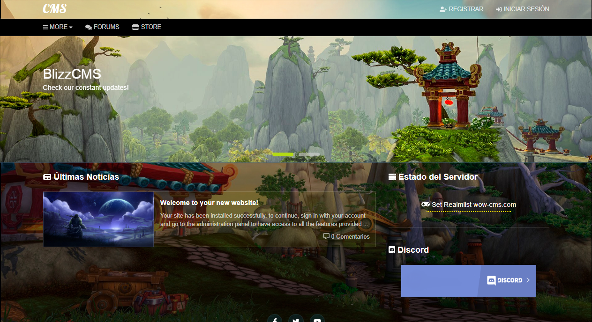

# Pandaren Theme

* Tema para BlizzCMS-Plus basado en la Expansión de Mist Of Pandaria de World of Warcraft.

# Project

* https://wow-cms.com/en/
* https://gitlab.com/WoW-CMS

# Installation

* Add the "Pandaren" folder in /application/themes/
* Then go to the admin panel and rename the theme to "Pandaren" save changes and you're good to go.

# Requirements

* BlizzCMS-Plus

# Author

* @Black_Tyrael

# Screenshots

